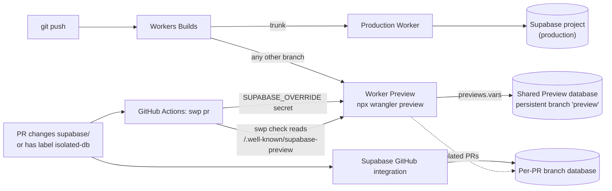

# supabase-worker-previews

Vercel-style branch previews for a **Cloudflare Worker** on **Supabase**. Every git branch gets a [Worker Preview](https://developers.cloudflare.com/workers/previews/) on a shared Preview database, every PR that changes `supabase/` gets its own Supabase branch database, and a CI check proves which database each Preview actually serves.

> **Status: beta.** Cloudflare [launched Worker Previews on 2026-09-22](https://developers.cloudflare.com/changelog/post/2026-09-22-worker-previews/), and this package is 0.x. Expect the platform and the CLI to change.
>
> Not affiliated with Supabase or Cloudflare.

## How it works



| Piece                    | Owner                       | Role                                                                                      |
| ------------------------ | --------------------------- | ----------------------------------------------------------------------------------------- |
| Production deploy        | Workers Builds              | Your normal deploy on the trunk                                                           |
| Preview deploy           | Workers Builds              | `npx wrangler preview` on every other branch                                              |
| Shared Preview database  | Supabase                    | A persistent branch (`preview`) that tracks the trunk; the GitHub integration migrates it |
| Per-PR database          | Supabase GitHub integration | Created for PRs that change `supabase/`, deleted on close                                 |
| `previews.vars`          | your wrangler config        | The shared database's public URL and publishable key                                      |
| `SUPABASE_OVERRIDE`      | `swp pr`                    | One Preview secret pointing an isolated PR at its own database                            |
| `withSupabasePreviews()` | your Worker                 | Applies the override, hands the browser its Supabase config, answers `swp check`          |

One build serves any database. The Worker reads its Supabase settings at request time and injects the public ones into each HTML page, so no `VITE_SUPABASE_URL`-style build-time values differ between environments. [How it works](docs/how-it-works.md) explains each choice.

## Quickstart

Needs a Worker deployed by [Workers Builds](https://developers.cloudflare.com/workers/ci-cd/builds/), wrangler 4.135.0 or later, a Supabase project on a plan with branching, and the repo on GitHub. The [full quickstart](docs/quickstart.md) has every dashboard setting and the expected output.

```bash
npm install --save-dev supabase-worker-previews
npx swp init --project-ref <production project ref>
```

`init` writes `swp.config.json`, a first migration that grants the API roles default privileges ([why](skills/supabase-worker-previews/references/gotchas.md#supabase-branches)), and `.github/workflows/supabase-previews.yml`. It never overwrites a file. Then:

1. **Supabase**: project settings, Integrations, GitHub. Connect the repo, turn on automatic branching, turn **off** "deploy to production" (your trunk deploy owns production migrations).
2. **Wrangler config**: add a `previews` block that redeclares every binding the Worker uses (Previews inherit none).
3. `npx swp shared`: creates the shared Preview database, stores its secret key in the Preview base config, and prints the `previews.vars` to paste in.
4. **Workers Builds**: enable non-production branch builds with the deploy command `npx wrangler preview`.
5. **GitHub Actions secrets**: `SUPABASE_ACCESS_TOKEN`, `CLOUDFLARE_API_TOKEN`, `CLOUDFLARE_ACCOUNT_ID`. See [tokens](docs/tokens.md) for least-privilege scopes.
6. Wrap the Worker and read the config in the browser:

```ts
// worker entry
import { withSupabasePreviews } from "supabase-worker-previews";
import app from "./app";
export default withSupabasePreviews(app);

// browser
import { readPublicConfig } from "supabase-worker-previews";
const { supabaseUrl, supabaseKey } = readPublicConfig() ?? {
  supabaseUrl: import.meta.env.VITE_SUPABASE_URL, // local dev server fallback
  supabaseKey: import.meta.env.VITE_SUPABASE_PUBLISHABLE_KEY,
};
```

Handlers receive `env` with the override applied, and so does `process.env` under `nodejs_compat`. A framework entry that is called without `env` (TanStack Start on Nitro calls `fetch(request)`) is handed `process.env` instead. Code that imports `env` from `cloudflare:workers` sees the raw values, so read Supabase settings from the handler's `env` or `process.env`. The [framework guides](#docs) show this for TanStack Start, Hono, React Router and Astro.

7. `npx swp doctor` checks all of it.

`wrangler.jsonc` ends up like:

```jsonc
{
  "name": "my-app",
  "main": "src/worker.ts",
  "kv_namespaces": [{ "binding": "CACHE", "id": "..." }],
  "previews": {
    "kv_namespaces": [{ "binding": "CACHE", "id": "..." }],
    "vars": {
      "SUPABASE_URL": "https://<preview branch ref>.supabase.co",
      "SUPABASE_PUBLISHABLE_KEY": "<its publishable key>",
      "SUPABASE_PROJECT_REF": "<preview branch ref>",
    },
  },
}
```

<!-- TODO(wrangler-toml): document wrangler.toml support once merged. Today doctor reads only the `name` from wrangler.toml and warns that the previews block is not checked. -->

<!-- TODO(action): once the composite action merges, show the `uses: mattruby/supabase-worker-previews@v0` workflow here as the alternative to the `npx swp pr` template. -->

## Commands

| Command                               | Does                                                                                                                      |
| ------------------------------------- | ------------------------------------------------------------------------------------------------------------------------- |
| `swp init`                            | Scaffold config, grants migration and workflow (never overwrites)                                                         |
| `swp doctor`                          | Check wrangler version, `previews` block, bindings, grants migration, auth redirects; with a token, the shared branch too |
| `swp shared`                          | Create or repair the shared Preview database                                                                              |
| `swp up --branch <b>`                 | Give a branch's Preview its own database                                                                                  |
| `swp check --branch <b> [--isolated]` | Fail unless the Preview serves the right database; fail at once on production                                             |
| `swp down --branch <b>`               | Delete the Preview and its own database                                                                                   |
| `swp pr`                              | Inside a `pull_request` workflow: `down` on close, else `up` when needed, then `check`                                    |

<!-- TODO(prune): add the `swp prune` row once merged. -->

`--branch` defaults to `WORKERS_CI_BRANCH`, then `GITHUB_HEAD_REF`, then the current git branch. Every command takes `--dry-run` and `--env-file <path>` (default `.env.swp` when present); `--worker`, `--project-ref` and `--trunk` override the config file. Environment: `SUPABASE_ACCESS_TOKEN`, `CLOUDFLARE_API_TOKEN`, `CLOUDFLARE_ACCOUNT_ID`, and `GITHUB_TOKEN` for `swp pr`.

`swp.config.json`:

| Field                | Default         |                                                      |
| -------------------- | --------------- | ---------------------------------------------------- |
| `supabaseProjectRef` | (required)      | The production project                               |
| `worker`             | wrangler `name` |                                                      |
| `trunk`              | `main`          | The branch the shared Preview database tracks        |
| `sharedBranch`       | `preview`       | Name of that Supabase branch                         |
| `supabaseDir`        | `supabase`      | Changes under it give a PR its own database          |
| `isolatedLabel`      | `isolated-db`   | PR label that asks for one anyway                    |
| `checkPath`          | `/`             | Page `check` scans when the identity route is absent |
| `workersSubdomain`   | looked up       | Your `*.workers.dev` subdomain                       |

<!-- TODO(preview-name-pr): add the `previewName` field (`"pr"` naming) once merged. -->

## Pull request feedback

`swp pr` keeps one comment on the PR (Preview URL, which database it serves, pass or fail with the reason, the commit) and records a GitHub deployment, which gives the PR a "View deployment" button. On close, the comment says what was removed and the deployments are marked inactive. GitHub API errors (a fork's read-only token, missing permissions, rate limits) become `::warning::` lines; only the database check fails the job. Turn either off with `"prComment": false` or `"githubDeployments": false` in `swp.config.json`, or `--no-comment` / `--no-deployments`. Deployments share one transient environment, `Preview` (set `"deploymentEnvironment"`; `"Preview: {branch}"` gives one per branch), and each PR only ever retires its own. The workflow needs:

```yaml
permissions:
  contents: read
  pull-requests: write
  deployments: write
```

### GitHub Action

Instead of installing the package and calling `npx swp pr`, a workflow can use the action ([full template](templates/supabase-previews-action.yml)). It runs the project's installed `swp` when there is one, else `supabase-worker-previews@<version>`.

```yaml
- uses: actions/checkout@v4
- uses: mattruby/supabase-worker-previews@v0
  with:
    supabase-access-token: ${{ secrets.SUPABASE_ACCESS_TOKEN }}
    cloudflare-api-token: ${{ secrets.CLOUDFLARE_API_TOKEN }}
    cloudflare-account-id: ${{ secrets.CLOUDFLARE_ACCOUNT_ID }}
    # working-directory: apps/web   version: "0"   comment: "false"   deployments: "false"   args: --dry-run
```

## Safety

- `swp` never writes to, repoints or deletes the production project through a branch record, and never deletes a persistent branch.
- `check` fails the first time a Preview serves production.
- `doctor` fails if `previews.vars` names production or holds a secret.

[Security](docs/security.md) covers what `swp` can touch and the blast radius of each token.

## Docs

- [Quickstart](docs/quickstart.md): from an existing Worker and Supabase project to the first working PR Preview
- [How it works](docs/how-it-works.md): environments, ownership, config injection, the override secret, the identity route
- [Troubleshooting](docs/troubleshooting.md): symptom, cause, fix
- [Tokens](docs/tokens.md): least-privilege Cloudflare, Supabase and GitHub credentials
- [Security](docs/security.md): what `swp` can touch, what is public, what is secret
- [Compared with Vercel](docs/vs-vercel.md): when to pick Vercel and its Supabase integration instead
- Frameworks: [TanStack Start](docs/frameworks/tanstack-start.md), [Hono](docs/frameworks/hono.md), [React Router v7](docs/frameworks/react-router.md), [Astro](docs/frameworks/astro.md)
- [Measured platform behaviour](skills/supabase-worker-previews/references/gotchas.md)

## Claude Code plugin

The repo is also a Claude Code plugin whose skill carries the measured platform behaviour (`skills/supabase-worker-previews`):

```
/plugin marketplace add mattruby/supabase-worker-previews
/plugin install supabase-worker-previews
```

## License

MIT
