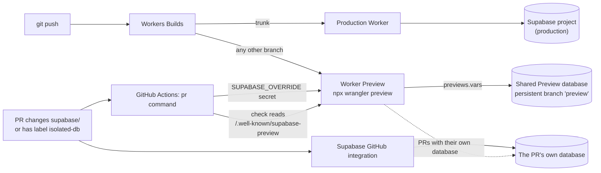

# supabase-worker-previews

[](https://www.npmjs.com/package/supabase-worker-previews)
[](https://github.com/mattruby/supabase-worker-previews/actions/workflows/ci.yml)
[](LICENSE)

**Vercel-style PR Previews for a Cloudflare Worker on Supabase, each on the right database, with a check that proves it.**

Every branch gets a [Worker Preview](https://developers.cloudflare.com/workers/previews/) on a shared Preview database. Every PR that changes `supabase/` gets its own database, migrated and seeded from the PR. One build serves all of them, and no Preview ever serves production.

## What you get

On every pull request, one comment that stays up to date:

> **Supabase Worker Preview** for `my-app`
>
> | Status                 | Preview            | Database                                       | Commit         | Updated (UTC)    |
> | :--------------------- | :----------------- | :--------------------------------------------- | :------------- | :--------------- |
> | **Passed** ([logs](#)) | [Visit Preview](#) | Shared [`preview`](#) (`abcdefghijklmnopqrst`) | [`1a2b3c4`](#) | 2026-10-01 03:10 |

Plus:

- a **View deployment** button on the PR, pointing at the Preview;
- a **Preview database** check that fails if the Preview serves the wrong database, and fails at once if it serves production;
- cleanup when the PR closes: the Preview and its own database are deleted, and the comment says so.

**You need this if** your app runs on Cloudflare Workers, deploys with [Workers Builds](https://developers.cloudflare.com/workers/ci-cd/builds/), keeps its data in Supabase, and you want every PR to have a working preview that cannot touch production data. If you are on Vercel, Supabase's own integration already does this; see [Compared with Vercel](docs/vs-vercel.md).

## How it works



It adds no infrastructure. Cloudflare builds the Previews and Supabase makes and migrates the databases; this package connects the two:

1. **Every Preview starts on the shared Preview database**, a persistent Supabase branch that tracks your trunk. Its public URL and key live in your wrangler config's `previews.vars`.
2. **A PR that changes the schema gets its own database.** The Supabase GitHub integration creates it; the `pr` command points the PR's Preview at it with one secret, `SUPABASE_OVERRIDE`.
3. **The Worker reads its Supabase settings per request.** `withSupabasePreviews()` applies the override and injects the public config into each HTML page, so no build-time `VITE_SUPABASE_URL` pins a database into the bundle.
4. **`check` asks the Preview which database it serves** and fails the PR unless it is the right one.

New to Worker Previews or Supabase branching? [Concepts](docs/concepts.md) explains both in five minutes.

## Quickstart

You need a Worker deployed by Workers Builds from a GitHub repo, wrangler 4.135.0 or later, Node 22 or later, and a Supabase project on a plan with branching.

```bash
npm install --save-dev supabase-worker-previews
npx supabase-worker-previews init --project-ref <production project ref>
```

`init` writes `supabase-worker-previews.json`, a grants migration and the PR workflow, and prints the rest. Then:

1. Connect the Supabase GitHub integration (automatic branching on, deploy to production off).
2. Add a `previews` block to your wrangler config.
3. `npx supabase-worker-previews shared` creates the shared Preview database and prints its `previews.vars`.
4. Wrap the Worker:

   ```ts
   import { withSupabasePreviews } from "supabase-worker-previews";
   import app from "./app";

   export default withSupabasePreviews(app);
   ```

   and create the browser client from `readPublicConfig()`.

5. Turn on Preview builds in Workers Builds, add three Actions secrets, run `npx supabase-worker-previews doctor`, and open a PR.

The **[full quickstart](docs/quickstart.md)** walks through every step with the dashboard settings and the output to expect. For a complete working project, see [`examples/hono-notes`](examples/hono-notes).

## Commands

Run each one as `npx supabase-worker-previews <command>`, or from an npm script.

| Group          | Command  | Does                                                                                               |
| -------------- | -------- | -------------------------------------------------------------------------------------------------- |
| **Set up**     | `init`   | Scaffold `supabase-worker-previews.json`, the grants migration and the workflow (never overwrites) |
|                | `doctor` | Check the whole setup, offline and (with a token) against Supabase                                 |
|                | `shared` | Create or repair the shared Preview database; prints its `previews.vars`                           |
| **Per branch** | `up`     | Give a branch's Preview its own database                                                           |
|                | `check`  | Fail unless the Preview serves the right database                                                  |
|                | `down`   | Delete a branch's Preview and its own database                                                     |
| **In CI**      | `pr`     | All of the above for a `pull_request` workflow, plus the PR comment and deployment                 |
|                | `prune`  | List leftovers of deleted branches and closed PRs; delete them with `--yes`                        |

`<command> --help` shows one command's flags and examples, and `--version` prints the version. Flags, environment variables, every `supabase-worker-previews.json` field and the GitHub Action inputs are in the [configuration reference](docs/configuration.md).

## Safety

- It never writes to, repoints or deletes the production project, and never deletes a persistent branch.
- `check` fails the first time a Preview serves production, with no retry.
- `doctor` fails if `previews.vars` names production or holds a secret.
- `prune` only lists until you pass `--yes`, and every command that changes something takes `--dry-run`.

[Security](docs/security.md) covers what the CLI can touch and what each token can reach.

## Docs

| Page                                       | For                                                                              |
| ------------------------------------------ | -------------------------------------------------------------------------------- |
| [Concepts](docs/concepts.md)               | Worker Previews, Supabase branches, and how this package joins them              |
| [Quickstart](docs/quickstart.md)           | From an existing Worker to the first working PR Preview                          |
| [Frameworks](docs/README.md#frameworks)    | TanStack Start, Hono, React Router v7, Astro                                     |
| [Troubleshooting](docs/troubleshooting.md) | Symptoms, causes and fixes                                                       |
| [How it works](docs/how-it-works.md)       | Every moving part and why it is built that way                                   |
| [Configuration](docs/configuration.md)     | Commands, flags, `supabase-worker-previews.json`, the GitHub Action, the runtime |
| [Tokens](docs/tokens.md)                   | Least-privilege Cloudflare, Supabase and GitHub credentials                      |
| [Security](docs/security.md)               | What the CLI can touch, what is public, what is secret                           |
| [Compared with Vercel](docs/vs-vercel.md)  | When Vercel and its Supabase integration are the better fit                      |

The full index is [docs/README.md](docs/README.md).

## Claude Code plugin

The repo is also a Claude Code plugin. Its skill carries the [measured platform behaviour](skills/supabase-worker-previews/references/gotchas.md) behind every design choice, so Claude can set up and debug Previews with it:

```text
/plugin marketplace add mattruby/supabase-worker-previews
/plugin install supabase-worker-previews
```

## Status

**Beta.** Cloudflare [launched Worker Previews on 2026-09-22](https://developers.cloudflare.com/changelog/post/2026-09-22-worker-previews/) as an open beta, and this package is 0.x. Expect both the platform and the CLI to change. Bug reports and platform findings are welcome; see [CONTRIBUTING.md](CONTRIBUTING.md).

Not affiliated with Supabase or Cloudflare.

## License

[MIT](LICENSE)
