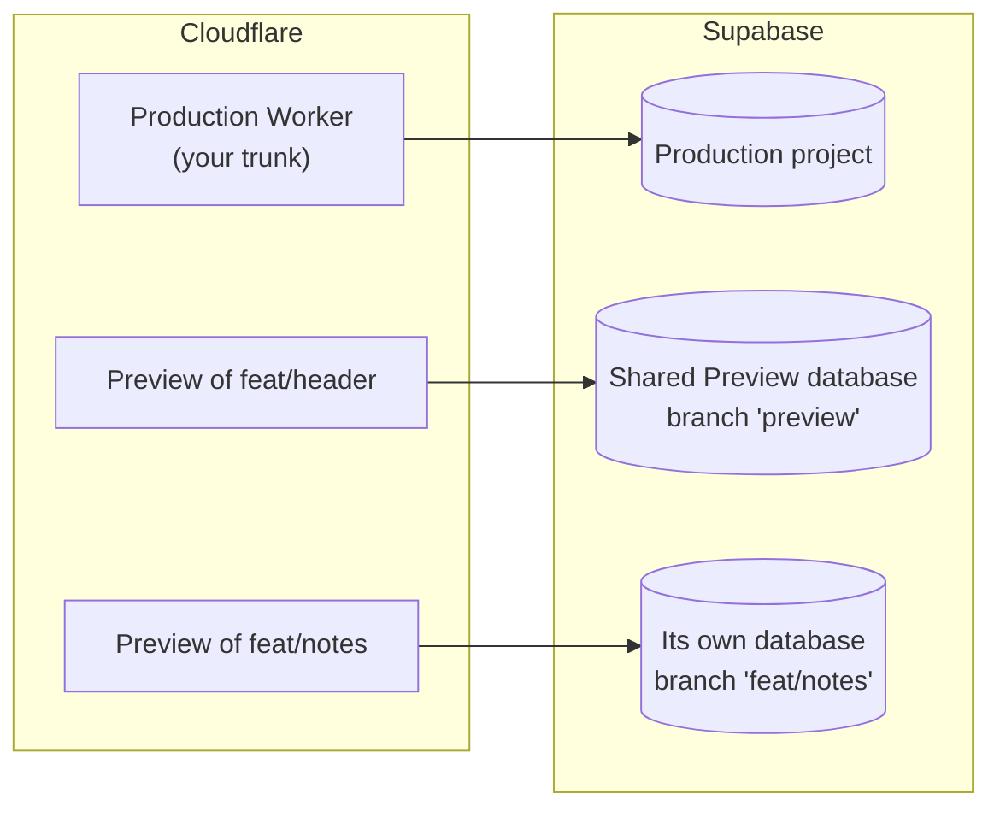

# Concepts

The five ideas `supabase-worker-previews` is built on, for anyone new to Cloudflare Worker Previews, Supabase branching, or both. Read this first; it takes about five minutes.



## Worker Previews

A [Worker Preview](https://developers.cloudflare.com/workers/previews/) is a separate deployment of your Worker for one branch, with its own URL:

```text
https://<branch slug>-<worker>.<subdomain>.workers.dev
```

[Workers Builds](https://developers.cloudflare.com/workers/ci-cd/builds/build-branches/) creates one when you push a branch that is not your production branch, by running `npx wrangler preview`. Each push to that branch deploys a new version to the same Preview and URL.

Two details shape everything `supabase-worker-previews` does:

- **Previews have their own config.** They inherit no bindings and no `vars` from the top level of your wrangler config. You declare them again in a `previews` block ([Cloudflare: configuration](https://developers.cloudflare.com/workers/previews/configuration/)).
- **Preview secrets are copied once.** A Preview copies the "base config" secrets when it is created and keeps that copy. Later changes reach only new Previews.

## Supabase branches

A [Supabase branch](https://supabase.com/docs/guides/deployment/branching) is a separate Supabase project made from your repo: its own Postgres database, its own API URL (`https://<branch ref>.supabase.co`) and its own API keys. When you connect the [Supabase GitHub integration](https://supabase.com/docs/guides/deployment/branching/github-integration), Supabase creates a branch for each PR that changes your `supabase/` directory, runs its migrations, loads `seed.sql`, and deletes the branch when the PR closes.

A branch can also be **persistent**: it stays until you delete it and follows a git branch you name. Branches are billed per hour of compute, and branching is not available on the Free plan ([pricing](https://supabase.com/pricing)).

## The shared Preview database and its own database

Most PRs do not change the schema, and giving each of them a fresh database would be slow and costly. So `supabase-worker-previews` uses two kinds of database for Previews:

| A PR that...                                            | Gets                            | Which is                                                              |
| ------------------------------------------------------- | ------------------------------- | --------------------------------------------------------------------- |
| does not change `supabase/`                             | the **shared Preview database** | one persistent branch, `preview`, that tracks your trunk's migrations |
| changes `supabase/`, or carries the `isolated-db` label | **its own database**            | the branch the integration made from that PR                          |

The shared Preview database is never production. Its URL and publishable key go in `previews.vars`, so every Preview uses it by default. A PR that needs its own database gets one Preview secret, `SUPABASE_OVERRIDE`, that points its Preview elsewhere.

## Config injected at request time

The usual way to give a browser app its Supabase URL is a build-time variable such as `VITE_SUPABASE_URL`. That bakes one database into the bundle. A Preview reuses the build Workers Builds made for its branch, so switching a PR to its own database would need a second build.

Instead, the Worker reads its Supabase settings on each request. `withSupabasePreviews()` applies any override, then adds a small script to each HTML page:

```html
<script>
  window.__SUPABASE_PUBLIC__ = { supabaseUrl: "https://...supabase.co", supabaseKey: "..." };
</script>
```

and `readPublicConfig()` reads it back in the browser. One build serves production, the shared Preview database or a PR's own database, and pointing a Preview somewhere new is a single secret write. Only public values (the URL and publishable key) reach the page.

## The identity route

How do you know which database a Preview actually serves? You ask it. The wrapped Worker answers:

```text
GET /.well-known/supabase-preview
{ "projectRef": "<ref>", "supabaseUrl": "https://<ref>.supabase.co" }
```

`supabase-worker-previews check` reads this route on every PR and passes only when the ref is the database the PR should have. If it ever sees production, it fails at once. That check is what turns "the deploy succeeded" into "this Preview is on the right database".

## Where to go next

- [Quickstart](quickstart.md): set it up on your own Worker.
- [`examples/hono-notes`](../examples/hono-notes): a small, complete project to read or copy.
- [How it works](how-it-works.md): every moving part in detail.

---

[← Previous: Docs index](README.md) · [Next: Quickstart →](quickstart.md)
