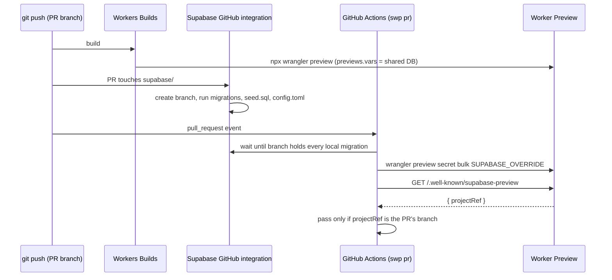

# How it works

`swp` adds no infrastructure of its own. Workers Builds deploys, Supabase's GitHub integration makes and migrates databases, and `swp` connects the two: it tells each Preview which database to use and then proves that it does. This page explains each part and why it is built that way. The measured platform behaviour behind each choice is in [gotchas.md](../skills/supabase-worker-previews/references/gotchas.md).

## Environments

| Environment                                                             | Worker                                | Database                                                        | How the Worker learns it                    |
| ----------------------------------------------------------------------- | ------------------------------------- | --------------------------------------------------------------- | ------------------------------------------- |
| Production                                                              | the trunk, deployed by Workers Builds | the Supabase project (`supabaseProjectRef`)                     | top-level `vars` and secrets                |
| Preview of any branch                                                   | `npx wrangler preview` on that branch | the shared, persistent `preview` branch, which tracks the trunk | `previews.vars` and the Preview base config |
| Preview of a PR that changes `supabase/` or has the `isolated-db` label | the same Preview                      | its own Supabase branch, made from the PR                       | the `SUPABASE_OVERRIDE` Preview secret      |
| Local dev server                                                        | your dev server                       | whatever your `.env` says                                       | `import.meta.env` fallback                  |



## Who owns what

| Thing                                       | Owner                       | `swp`'s part                                                                                                                                             |
| ------------------------------------------- | --------------------------- | -------------------------------------------------------------------------------------------------------------------------------------------------------- |
| Production deploy and migrations            | your trunk pipeline         | none                                                                                                                                                     |
| Preview builds                              | Workers Builds              | reads the Previews list to find a branch's Preview and its URL                                                                                           |
| Shared database's schema                    | Supabase GitHub integration | `swp shared` creates the persistent branch once and repairs its settings                                                                                 |
| Per-PR database lifecycle                   | Supabase GitHub integration | `swp up` reuses the integration's branch, or asks Supabase for one (a labelled PR, or before the integration has made it); `down` deletes a leftover one |
| Shared database's public values             | your wrangler config        | `swp shared` prints them; `doctor` checks them                                                                                                           |
| Shared database's secret key                | Preview base config         | `swp shared` writes it                                                                                                                                   |
| Per-PR database values                      | Preview secret              | `swp up` writes `SUPABASE_OVERRIDE`                                                                                                                      |
| Which database a Preview serves, at runtime | `withSupabasePreviews()`    | applies the override, injects public config, serves the identity route                                                                                   |
| Proof                                       | `swp check`                 | fails unless the Preview serves the expected database                                                                                                    |

## The shared Preview database

`swp shared` creates a Supabase branch named `preview` (`sharedBranch`), marked persistent and tied to the trunk (`git_branch = trunk`). Because the GitHub integration owns it, every push to the trunk runs the new migrations on it, so the shared database's schema follows production's.

If the project has never branched, `shared` first creates and removes a throwaway branch. The first branch on a never-branched project either relabels the project itself as that branch or creates a real database and renames the project's branch `main`; both were seen. The throwaway keeps a real branch from being mistaken for production.

`shared` then waits for the migrations (below), sets the branch's auth Site URL to the production `workers.dev` hostname with `https://*-<worker>.<subdomain>.workers.dev/**` as an allowed redirect, writes the branch's secret key to the Preview base config, and prints the public values for `previews.vars`.

## Why public values live in `previews.vars`

A Preview copies the base config **once, when it is created**, and keeps that copy. Changing the base config never reaches an existing Preview, and redeploying does not refresh it ([measured](../skills/supabase-worker-previews/references/gotchas.md#cloudflare-worker-previews); Cloudflare: "Later changes to Base secrets apply only to new Previews", [configuration](https://developers.cloudflare.com/workers/previews/configuration/)).

`previews.vars` is read from the wrangler config on every Preview deploy, so changing it reaches every Preview on its next build. The shared database's URL, publishable key and ref are public, so they can be committed there. Only the secret key goes in the base config, where staleness matters least because it only changes when you rotate it.

## The override secret

An isolated PR needs four different values: `SUPABASE_URL`, `SUPABASE_PUBLISHABLE_KEY`, `SUPABASE_SERVICE_ROLE_KEY` and `SUPABASE_PROJECT_REF`. They cannot be four Preview secrets, because a Worker var and a secret must never share a name, and the first three already exist as `previews.vars` and a base config secret.

So `swp up` writes **one** secret, `SUPABASE_OVERRIDE`, whose value is a JSON object holding all four. `withSupabasePreviews()` parses it and, when present, replaces the four values for every handler. A malformed override throws `SUPABASE_OVERRIDE is missing <name>` rather than silently falling back to the shared database.

Writing a Preview secret creates a new deployment of that Preview, so the override takes effect without a rebuild.

The secret key comes from the branch's API keys: the legacy `anon`/`service_role` pair when the project has it, otherwise the newer publishable/secret pair. Either way the Worker sees it as `SUPABASE_SERVICE_ROLE_KEY`.

<!-- TODO(new-keys): document new Supabase key support (names, any new vars) once merged. -->

<!-- TODO(stale-override): today the override stays on a Preview if a PR later stops needing its own database (for example the label is removed or the supabase/ change is reverted), and `check` then fails because the Preview still serves the PR branch. Describe the removal behaviour once merged. -->

## Request-time config injection

`withSupabasePreviews(handler, options)` wraps the Worker's default export:

- Every handler (`fetch`, `scheduled`, `queue`, ...) receives `env` with the override applied. Under `nodejs_compat`, the override is also written into `process.env`.
- `fetch` answers the identity route (below) before calling your handler.
- For any response whose `content-type` contains `text/html`, it prepends `<script>window.__SUPABASE_PUBLIC__={"supabaseUrl":...,"supabaseKey":...}</script>` to `<head>`, using `HTMLRewriter` on Workers.
- Only HTML that passes through the Worker is injected. With [static assets](https://developers.cloudflare.com/workers/static-assets/binding/#run_worker_first), a request that matches an asset (such as an SPA's `index.html`) is served without invoking the Worker by default; set `assets.run_worker_first` so HTML routes reach it.
- In the browser, `readPublicConfig()` returns those two values, or `null` when the page was not served through the Worker (a dev server), so you can fall back to `import.meta.env`.

| Option       | Default                 | Effect                                                                                   |
| ------------ | ----------------------- | ---------------------------------------------------------------------------------------- |
| `globalName` | `"__SUPABASE_PUBLIC__"` | Window property the config is written to; pass the same name to `readPublicConfig(name)` |
| `inject`     | `true`                  | Inject the public config into HTML                                                       |
| `identity`   | `true`                  | Serve `/.well-known/supabase-preview`                                                    |

Why request time: a Preview reuses the build Workers Builds made for its branch. Build-time values such as `VITE_SUPABASE_URL` would bake one database into the bundle, and pointing an isolated PR at its own database would need a second build. Reading the values per request means one build serves any database, and only a secret changes.

**The caveat:** code that does `import { env } from "cloudflare:workers"` reads the bindings directly and sees the raw values, not the override. Read Supabase settings from the handler's `env` or from `process.env`. The [framework guides](frameworks/) say where each framework hands you `env`.

## The identity route

`GET /.well-known/supabase-preview` returns, with `cache-control: no-store`:

```json
{ "projectRef": "<ref>", "supabaseUrl": "https://<ref>.supabase.co" }
```

`projectRef` is `SUPABASE_PROJECT_REF`, or the ref parsed from `SUPABASE_URL` when it is a `*.supabase.co` URL. Both values are public.

`swp check` reads this route. If the Worker does not serve it (not wrapped, or `identity: false`), `check` fetches `checkPath` (default `/`) and looks for exactly one `https://<20-char ref>.supabase.co` URL in the HTML. Several refs, or none, count as a miss.

## The check

`swp check --branch <b> [--isolated]`:

1. Works out the expected database: the PR's own branch when isolated, else the `sharedBranch`. It refuses if that record is the production project.
2. Finds the branch's Preview in `GET /accounts/{id}/workers/workers/{worker}/previews`, matching the raw git branch name first, then the slug. Workers Builds names a Preview after the raw branch and Cloudflare derives the slug and URL, so `swp` reads both rather than guessing.
3. Asks the Preview which database it serves.
4. **Production fails at once.** The expected database passes. Anything else (no Preview yet, a Preview that was never deployed, the wrong database) is retried every 20 seconds, 45 times, because Workers Builds and `up` may still be finishing.

## Waiting for migrations

Supabase reports a branch as `FUNCTIONS_DEPLOYED` before its migrations finish. `swp` waits until `supabase_migrations.schema_migrations` holds at least as many rows as there are `.sql` files in `supabase/migrations/` in the checkout, polling every 10 seconds for up to 15 minutes, and stops early if the branch reports `MIGRATIONS_FAILED` or `FUNCTIONS_FAILED`.

## `swp pr`

In a `pull_request` workflow it reads the event and:

- on `closed`: runs `down` (deletes the PR's own Supabase branch unless it is persistent, then the Preview);
- otherwise: lists the PR's changed files through the GitHub API (including the old path of renamed files), decides the PR is isolated if any path starts with `supabaseDir/` or the PR has the `isolatedLabel` label, runs `up` when isolated, then `check`.

The template workflow runs on `opened`, `synchronize`, `reopened`, `labeled` and `closed`, one run at a time per branch.

<!-- TODO(fork-prs): describe fork-PR skipping once merged. -->
<!-- TODO(pr-comment): describe the sticky PR comment once merged. -->
<!-- TODO(github-deployments): describe GitHub Deployments once merged. -->
<!-- TODO(prune): describe `swp prune` once merged. -->
<!-- TODO(preview-name-pr): describe `previewName: "pr"` naming once merged. -->

## Why the grants migration comes first

Supabase branches, and newer projects, start without default privileges for the API roles. A table created by a migration then has only owner privileges and every signed-in read 403s. Only a migration can grant them back, and it must run before any table exists. `swp init` writes `templates/default-privileges.sql` as the first migration and `doctor` checks it is still first. With it in place, an integration-made branch matched production object for object (0 ACL differences across about 190 objects).

## Safety guarantees

These are enforced in code, not by convention:

- `assertIsolated` refuses any branch record that is the default branch or whose ref is the production project, before `shared`, `up`, `check` or `down` write to, repoint or delete it.
- `down` never deletes a persistent branch.
- `check` throws `Preview <slug> serves the production database <ref>; refusing to pass` the first time it sees production, with no retry.
- `doctor` fails if `previews.vars` points at the production ref or contains `SUPABASE_SERVICE_ROLE_KEY` or `SUPABASE_OVERRIDE`.
- Every command takes `--dry-run`, which prints the wrangler commands and API writes instead of running them. `shared`, `up`, `check`, `down` and `pr` still require `SUPABASE_ACCESS_TOKEN` in dry-run, and the reads still happen (`shared` lists branches, `down` lists branches and Previews, `pr` lists the PR's files).

[Security](security.md) covers what each token can reach.
