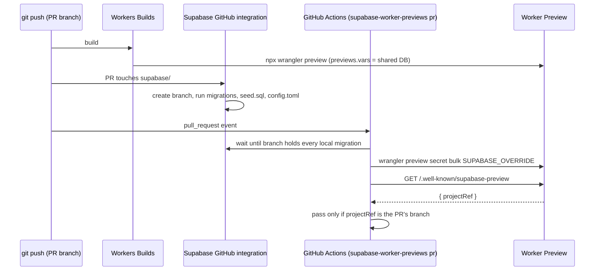

# How it works

Every moving part of `supabase-worker-previews`, who owns it, and why it is built that way. Read it when you want to understand a behaviour rather than just set it up.

`supabase-worker-previews` adds no infrastructure of its own. Workers Builds deploys, Supabase's GitHub integration makes and migrates databases, and `supabase-worker-previews` connects the two: it tells each Preview which database to use and then proves that it does. The measured platform behaviour behind each choice is in [gotchas.md](../skills/supabase-worker-previews/references/gotchas.md).

## Environments

| Environment                                                             | Worker                                | Database                                                        | How the Worker learns it                    |
| ----------------------------------------------------------------------- | ------------------------------------- | --------------------------------------------------------------- | ------------------------------------------- |
| Production                                                              | the trunk, deployed by Workers Builds | the Supabase project (`supabaseProjectRef`)                     | top-level `vars` and secrets                |
| Preview of any branch                                                   | `npx wrangler preview` on that branch | the shared, persistent `preview` branch, which tracks the trunk | `previews.vars` and the Preview base config |
| Preview of a PR that changes `supabase/` or has the `isolated-db` label | the same Preview                      | its own Supabase branch, made from the PR                       | the `SUPABASE_OVERRIDE` Preview secret      |
| Local dev server                                                        | your dev server                       | whatever your `.env` says                                       | `import.meta.env` fallback                  |



## Who owns what

| Thing                                       | Owner                            | `supabase-worker-previews`'s part                                                                                                                                                                                                                   |
| ------------------------------------------- | -------------------------------- | --------------------------------------------------------------------------------------------------------------------------------------------------------------------------------------------------------------------------------------------------- |
| Production deploy and migrations            | your trunk pipeline              | none                                                                                                                                                                                                                                                |
| Preview builds                              | Workers Builds                   | reads the Previews list to find a branch's Preview and its URL                                                                                                                                                                                      |
| Shared Preview database's schema            | Supabase GitHub integration      | `supabase-worker-previews shared` creates the persistent branch once and repairs its settings                                                                                                                                                       |
| A PR's own database: lifecycle              | Supabase GitHub integration      | `supabase-worker-previews up` reuses the integration's branch, or asks Supabase for one (a labelled PR, or before the integration has made it); `supabase-worker-previews pr` deletes one a PR no longer needs; `down` and `prune` delete leftovers |
| Shared Preview database's public values     | your wrangler config             | `supabase-worker-previews shared` prints them; `doctor` checks them                                                                                                                                                                                 |
| Shared Preview database's secret key        | Preview base config              | `supabase-worker-previews shared` writes it                                                                                                                                                                                                         |
| A PR's own database: values                 | Preview secret                   | `supabase-worker-previews up` writes `SUPABASE_OVERRIDE`; `supabase-worker-previews pr` removes it when the PR no longer needs its own database                                                                                                     |
| Which database a Preview serves, at runtime | `withSupabasePreviews()`         | applies the override, injects public config, serves the identity route                                                                                                                                                                              |
| Proof                                       | `supabase-worker-previews check` | fails unless the Preview serves the expected database                                                                                                                                                                                               |

## The shared Preview database

`supabase-worker-previews shared` creates a Supabase branch named `preview` (`sharedBranch`), marked persistent and tied to the trunk (`git_branch = trunk`). Because the GitHub integration owns it, every push to the trunk runs the new migrations on it, so the shared Preview database's schema follows production's.

If the project has no default branch (branching was never enabled), `shared` stops with `Branching is not enabled on <ref>. Connect the repo in the Supabase dashboard (...)`. Connecting the Supabase GitHub integration with automatic branching on enables it. `supabase-worker-previews` does not create the first branch itself: the first branch made on a never-branched project either relabelled the project itself as that branch or created a real database and renamed the project's branch `main` (both were seen), and `supabase-worker-previews` must never touch the production project's branch record.

`shared` then waits for the migrations (below), sets the branch's auth Site URL to the production `workers.dev` hostname with `https://*-<worker>.<subdomain>.workers.dev/**` as an allowed redirect, writes the branch's secret key to the Preview base config, and prints the public values for `previews.vars`.

## Why public values live in `previews.vars`

A Preview copies the base config **once, when it is created**, and keeps that copy. Changing the base config never reaches an existing Preview, and redeploying does not refresh it ([measured](../skills/supabase-worker-previews/references/gotchas.md#cloudflare-worker-previews); Cloudflare: "Later changes to Base secrets apply only to new Previews", [configuration](https://developers.cloudflare.com/workers/previews/configuration/)).

`previews.vars` is read from the wrangler config on every Preview deploy, so changing it reaches every Preview on its next build. The shared Preview database's URL, publishable key and ref are public, so they can be committed there. Only the secret key goes in the base config, where staleness matters least because it only changes when you rotate it.

## The override secret

A PR with its own database needs four different values: `SUPABASE_URL`, `SUPABASE_PUBLISHABLE_KEY`, `SUPABASE_SERVICE_ROLE_KEY` and `SUPABASE_PROJECT_REF`. They cannot be four Preview secrets, because a Worker var and a secret must never share a name, and the first three already exist as `previews.vars` and a base config secret.

So `supabase-worker-previews up` writes **one** secret, `SUPABASE_OVERRIDE`, whose value is a JSON object holding all four. `withSupabasePreviews()` parses it and, when present, replaces the four values for every handler. A malformed override throws `SUPABASE_OVERRIDE is missing <name>` rather than silently falling back to the shared Preview database.

Writing a Preview secret creates a new deployment of that Preview, so the override takes effect without a rebuild.

### Which API keys

`supabase-worker-previews` reads the branch's keys with `GET /v1/projects/{ref}/api-keys?reveal=true` and hands the Preview one matched pair:

| `apiKeys` (`supabase-worker-previews.json`) | Pair                                                                                                             |
| ------------------------------------------- | ---------------------------------------------------------------------------------------------------------------- |
| `"legacy"` (default)                        | `anon` and `service_role` (JWTs), unless the project has disabled legacy keys                                    |
| `"new"`                                     | the `publishable` and `secret` keys (`sb_publishable_...`, `sb_secret_...`), preferring the ones named `default` |

If the preferred pair is missing, `supabase-worker-previews` uses the other kind. Either way the Worker sees the pair as `SUPABASE_PUBLISHABLE_KEY` and `SUPABASE_SERVICE_ROLE_KEY`; the variable names do not change. The new keys are not JWTs, so Edge Functions that verify JWTs reject them ([measured](../skills/supabase-worker-previews/references/gotchas.md#supabase-branches)); stay on `"legacy"` if yours do.

Without permission to reveal secrets, the API returns secret keys masked with `·`. `supabase-worker-previews` refuses those with `Project <ref>: the access token cannot reveal secret API keys; use a token with the project's secrets permission` rather than writing a masked key into a Preview.

### Dropping a stale override

A PR can stop needing its own database: the `isolated-db` label is removed, or the `supabase/` change is reverted. On the next run (the workflow also triggers on `unlabeled`), `supabase-worker-previews pr` takes the shared path and first runs `release`:

1. It lists the Preview's secrets (`wrangler preview secret list --json`) and, if `SUPABASE_OVERRIDE` is there, deletes it (`wrangler preview secret delete --skip-confirmation`). Deleting a secret creates a new deployment of the Preview, which then reads `previews.vars` again.
2. It deletes the Supabase branch tied to the git branch, but only if that branch is disposable: not the default branch, not the production project, not persistent, not the shared branch, and not tracking the trunk. The integration only makes branches for PRs that change `supabase/`, so on this path the branch is one `up` made for a label.

Then `check` expects the shared Preview database as usual.

## Request-time config injection

`withSupabasePreviews(handler, options)` wraps the Worker's default export:

- Every handler (`fetch`, `scheduled`, `queue`, ...) receives `env` with the override applied. Under `nodejs_compat`, the override is also written into `process.env`. If a framework calls the entry without `env` (TanStack Start on Nitro calls `fetch(request)`), the wrapper uses `process.env` as the env.
- `fetch` answers the identity route (below) before calling your handler.
- For any response whose `content-type` contains `text/html`, it prepends `<script>window.__SUPABASE_PUBLIC__={"supabaseUrl":...,"supabaseKey":...}</script>` to `<head>`, using `HTMLRewriter` on Workers.
- Only HTML that passes through the Worker is injected. With [static assets](https://developers.cloudflare.com/workers/static-assets/binding/#run_worker_first), a request that matches an asset (such as an SPA's `index.html`) is served without invoking the Worker by default; set `assets.run_worker_first` so HTML routes reach it.
- In the browser, `readPublicConfig()` returns those two values, or `null` when the page was not served through the Worker (a dev server), so you can fall back to `import.meta.env`.

| Option       | Default                 | Effect                                                                                   |
| ------------ | ----------------------- | ---------------------------------------------------------------------------------------- |
| `globalName` | `"__SUPABASE_PUBLIC__"` | Window property the config is written to; pass the same name to `readPublicConfig(name)` |
| `inject`     | `true`                  | Inject the public config into HTML                                                       |
| `identity`   | `true`                  | Serve `/.well-known/supabase-preview`                                                    |

Why request time: a Preview reuses the build Workers Builds made for its branch. Build-time values such as `VITE_SUPABASE_URL` would bake one database into the bundle, and pointing a PR at its own database would need a second build. Reading the values per request means one build serves any database, and only a secret changes.

**The caveat:** code that does `import { env } from "cloudflare:workers"` reads the bindings directly and sees the raw values, not the override. Read Supabase settings from the handler's `env` or from `process.env`. The [framework guides](README.md#frameworks) say where each framework hands you `env`.

## The identity route

`GET /.well-known/supabase-preview` returns, with `cache-control: no-store`:

```json
{ "projectRef": "<ref>", "supabaseUrl": "https://<ref>.supabase.co" }
```

`projectRef` is `SUPABASE_PROJECT_REF`, or the ref parsed from `SUPABASE_URL` when it is a `*.supabase.co` URL. Both values are public.

`supabase-worker-previews check` reads this route. If the Worker does not serve it (not wrapped, or `identity: false`), `check` fetches `checkPath` (default `/`) and looks for exactly one `https://<20-char ref>.supabase.co` URL in the HTML. Several refs, or none, count as a miss.

## The check

`supabase-worker-previews check [--branch <b>] [--pr <n>] [--isolated]`:

1. Works out the expected database: the PR's own branch when isolated, else the `sharedBranch`. It refuses if that record is the production project.
2. Finds the branch's Preview in `GET /accounts/{id}/workers/workers/{worker}/previews`, matching the raw git branch name first, then the slug. Workers Builds names a Preview after the raw branch and Cloudflare derives the slug and URL, so `supabase-worker-previews` reads both rather than guessing. With `previewName: "pr"` it looks for `pr-<n>` instead (see below).
3. Asks the Preview which database it serves.
4. **Production fails at once.** The expected database passes. Anything else (no Preview yet, a Preview that was never deployed, the wrong database) is retried every 20 seconds, 45 times, because Workers Builds and `up` may still be finishing.

## Waiting for migrations

Supabase reports a branch as `FUNCTIONS_DEPLOYED` before its migrations finish. `supabase-worker-previews` waits until `supabase_migrations.schema_migrations` holds at least as many rows as there are `.sql` files in `supabase/migrations/` in the checkout, polling every 10 seconds for up to 15 minutes, and stops early if the branch reports `MIGRATIONS_FAILED` or `FUNCTIONS_FAILED`.

## `supabase-worker-previews pr`

In a `pull_request` workflow it reads the event and:

- first, skips the run if the PR comes from a fork (or a deleted fork), with a `::notice::`, and handles empty `SUPABASE_ACCESS_TOKEN`, `CLOUDFLARE_API_TOKEN`, `CLOUDFLARE_ACCOUNT_ID` or `GITHUB_TOKEN`: a bot's PR (actor ending in `[bot]`, such as Dependabot, which gets no Actions secrets) is skipped with a `::warning::`, anyone else's fails with an `::error::` naming them. GitHub gives fork PRs no secrets, so failing them would only make every outside contribution red, while a person's PR without secrets means the repo is misconfigured;
- on `closed`: runs `down` (deletes the PR's own Supabase branch unless it is persistent, then the Preview);
- otherwise: lists the PR's changed files through the GitHub API (including the old path of renamed files), decides the PR is isolated if any path starts with `supabaseDir/` or the PR has the `isolatedLabel` label, runs `up` when isolated or `release` when not, then `check`.

The template workflow runs on `opened`, `synchronize`, `reopened`, `labeled`, `unlabeled` and `closed`, one run at a time per branch.

### Reporting on the PR

Around that work, `supabase-worker-previews pr` reports in two ways. Both are skipped in `--dry-run`, and any GitHub API error in them (missing permission, rate limit) becomes a `::warning::` line instead of failing the job; only the database work decides the result.

- **One status comment**, found by the marker `<!-- supabase-worker-previews -->` and edited in place. It is written when the run starts (Checking) and again when it ends (**Passed**, or **Failed** with the error), with the Preview link, the database (shared or its own branch, linked to the Supabase branches dashboard), the commit and a link to the run's logs. On close it says the Preview, and its own database if it had one, were removed. Turn it off with `"prComment": false` or `--no-comment`.
- **A GitHub deployment** of the PR head, which gives the PR a "View deployment" button. It is created `in_progress`, then set to `success` with the Preview URL or `failure` with the error. Every PR shares one transient environment, `Preview`, so the repository does not collect an environment per PR that `GITHUB_TOKEN` cannot delete. Each deployment carries the PR number in its payload; after a success, and on close, `supabase-worker-previews pr` marks that PR's older deployments inactive and never touches other PRs'. Rename the environment with `"deploymentEnvironment"`, where `{branch}` is replaced by the branch name (`"Preview: {branch}"` gives one environment per branch). Turn it off with `"githubDeployments": false` or `--no-deployments`.

The comment needs `pull-requests: write` and the deployment `deployments: write`; see [tokens](tokens.md#github_token).

### The GitHub Action

`uses: mattruby/supabase-worker-previews@v0` ([action.yml](../action.yml)) is a composite action that runs `supabase-worker-previews <command>` (default `pr`) with the inputs mapped to the same environment variables and flags. It runs the project's installed `supabase-worker-previews` if `npx --no-install supabase-worker-previews help` succeeds, otherwise `npx supabase-worker-previews@<version>` (default `0`). `comment: "false"` and `deployments: "false"` become `--no-comment` and `--no-deployments`; `args` is appended, split on spaces.

## Preview names: `previewName`

| `previewName`        | The Preview for a git branch is named | Use when                                                                                                                                                                  |
| -------------------- | ------------------------------------- | ------------------------------------------------------------------------------------------------------------------------------------------------------------------------- |
| `"branch"` (default) | the raw git branch (`feat/x`)         | Workers Builds deploys Previews; it names them after the branch                                                                                                           |
| `"pr"`               | `pr-<number>`                         | your own CI runs `wrangler preview --name pr-<number>`, as in Cloudflare's [automation examples](https://developers.cloudflare.com/workers/previews/automation-examples/) |

With `"pr"`, `up`, `check` and `down` need `--pr <n>` (otherwise: `previewName is "pr", so pass the PR number (--pr <n>)`), and `supabase-worker-previews pr` uses the event's PR number. The Supabase branch stays tied to the git branch either way.

## Cleaning up: `supabase-worker-previews prune`

`down` runs when a PR closes, but leftovers can still pile up: a Preview of a branch that was deleted without a PR, a database whose close event was missed. `supabase-worker-previews prune` lists them, and deletes them only with `--yes` (never in `--dry-run`). It reads the repo's branches and open PRs with `GITHUB_TOKEN`, from `--repo <owner/name>` or `GITHUB_REPOSITORY`.

| Kind             | A leftover when                                                                                                                                                                       |
| ---------------- | ------------------------------------------------------------------------------------------------------------------------------------------------------------------------------------- |
| Supabase branch  | it is disposable (as above), has a git branch with no open PR, and that git branch is deleted or has a closed PR. A database whose git branch still exists and never had a PR is kept |
| Preview (branch) | no repo branch matches its name or slug. A pushed branch without a PR keeps its Preview. A Preview you created by hand with a `--name` that matches no branch counts as a leftover    |
| Preview (pr)     | it is named `pr-<n>` and PR `n` is not open                                                                                                                                           |

The trunk's Preview is never pruned. Run it with `--yes` from a scheduled workflow, or by hand.

## Why the grants migration comes first

Supabase branches, and newer projects, start without default privileges for the API roles. A table created by a migration then has only owner privileges and every signed-in read 403s. Only a migration can grant them back, and it must run before any table exists. `supabase-worker-previews init` writes `templates/default-privileges.sql` as the first migration and `doctor` checks it is still first. With it in place, an integration-made branch matched production object for object (0 ACL differences across about 190 objects).

## Safety guarantees

These are enforced in code, not by convention:

- `assertIsolated` refuses any branch record that is the default branch or whose ref is the production project, before `shared`, `up`, `check`, `down`, `release` or `prune` write to, repoint or delete it.
- `shared` refuses a project without branching instead of creating its first branch.
- `down` never deletes a persistent branch; `release` and `prune` also spare the shared branch and any branch tracking the trunk.
- `prune` deletes nothing without `--yes`.
- `check` throws `Preview <slug> serves the production database <ref>; refusing to pass` the first time it sees production, with no retry.
- `doctor` fails if `previews.vars` points at the production ref or contains `SUPABASE_SERVICE_ROLE_KEY` or `SUPABASE_OVERRIDE`.
- Every command that changes something (all but `doctor`) takes `--dry-run`, which prints the wrangler commands and API writes instead of running them. `shared`, `up`, `check`, `down`, `pr` and `prune` still require `SUPABASE_ACCESS_TOKEN` in dry-run (and `GITHUB_TOKEN` for `pr` and `prune`), and the reads still happen (`shared` lists branches; `down` lists branches and Previews; `pr` lists the PR's files and, on the shared path, Previews and branches; `prune` reads everything it plans from).

[Security](security.md) covers what each token can reach.

---

[← Previous: Troubleshooting](troubleshooting.md) · [Docs index](README.md) · [Next: Configuration →](configuration.md)
